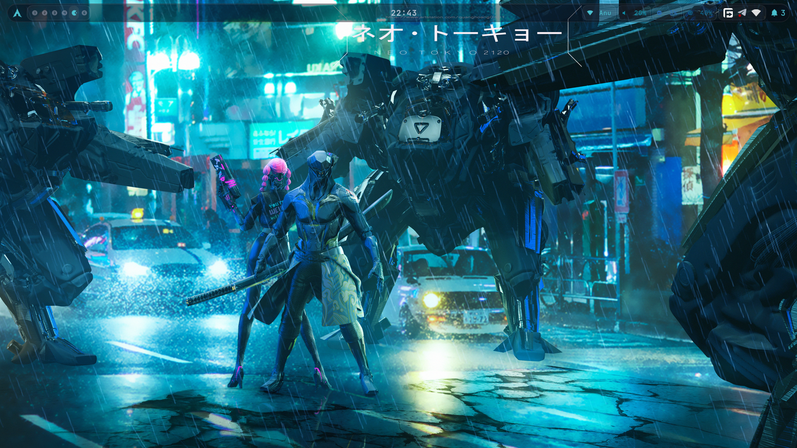
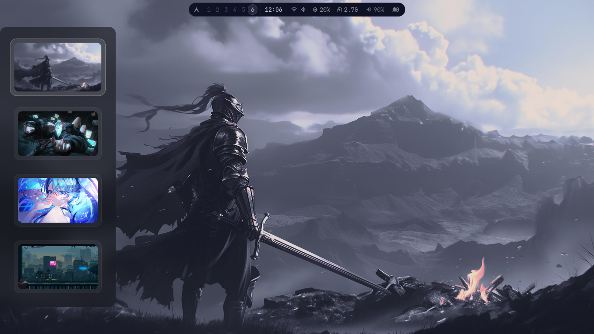
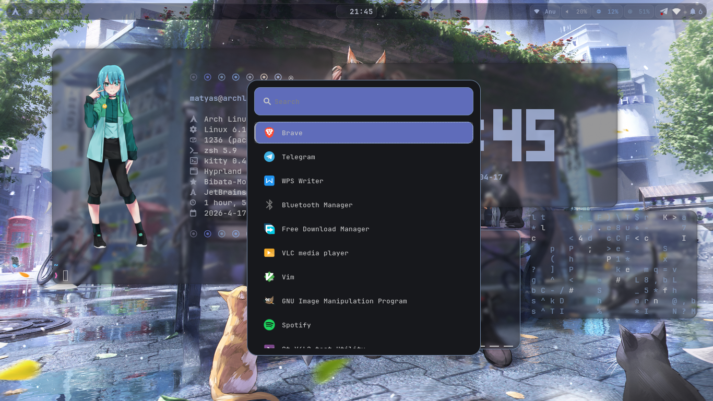
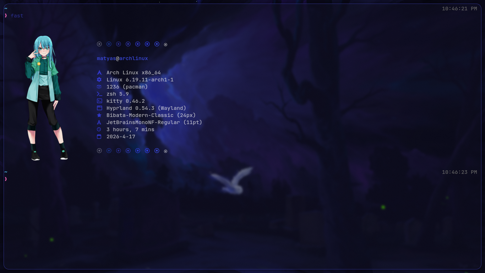
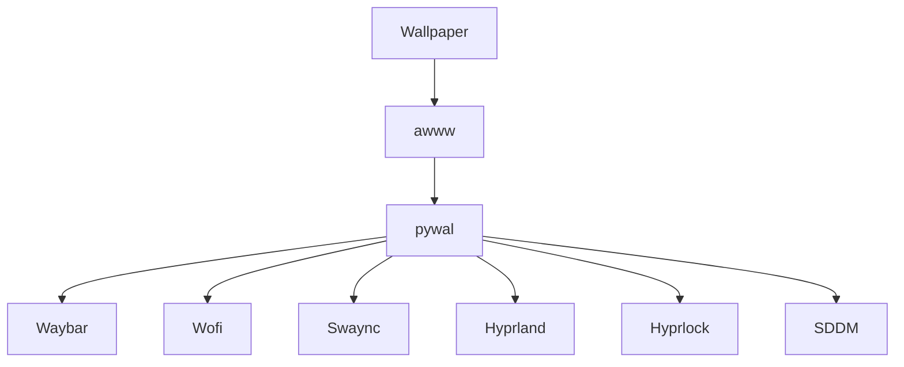

<div align="center">

# 🪟 Matyas' Hyprland Rice

[](https://hyprland.org/)
[](https://wayland.freedesktop.org/)
[](https://github.com/eylles/pywal16)
[](https://opensource.org/licenses/MIT)

A clean, modern, and highly polished **Hyprland** setup featuring **glassmorphism**, dynamic **pywal** theming, smooth animations, and seamless wallpaper integration.

**Created by [Matyas Abraham (Maty156)](https://github.com/Maty156)**

</div>

---

## 📑 Table of Contents

* [✨ Features](#-features)
* [📸 Screenshots](#-screenshots)
* [📦 What's Included](#-whats-included)
* [🛠️ Dependencies & Installation](#️-dependencies--installation)
* [🚀 Quick Setup](#-quick-setup)
* [⌨️ Keybindings](#️-keybindings)
* [🎨 Color Pipeline](#-color-pipeline)
* [🖼️ Adding Wallpapers](#️-adding-wallpapers)
* [📁 Directory Structure](#-directory-structure)
* [📄 License](#-license)

---

## ✨ Features

* 💎 **Glassmorphism** — Elegant Waybar with smooth blurs and glowing borders
* 📏 **Smart Gaps** — Automatically hide gaps when only one window is open
* ✦ **Matuwall Panel Picker** — Beautiful wallpaper picker sliding from the left (`SUPER + W`)
* 🎨 **Full pywal Pipeline** — All components update automatically with your wallpaper
* 🌄 **awww Wallpaper Daemon** — Smooth transitions + persistence across reboots
* 🔒 **Hyprlock** — Lock screen always matches the current wallpaper
* 🖥️ **SDDM** — Login screen synced with pywal colors and wallpaper
* ⚡ **Fluid Animations** — Beautiful bezier curves for windows and menus
* 🔊 **Volume & Brightness OSD** — Clean `wob` overlay for media keys

---

## 📸 Screenshots

### Desktop Overview

<p align="center">
  
</p>

### Wallpaper Picker & Launcher

<table align="center">
  <tr>
    <td align="center"><strong>Wallpaper Picker</strong><br></td>
    <td align="center"><strong>Wofi Launcher</strong><br></td>
  </tr>
</table>

### Fastfetch

<p align="center">
  
</p>

---

## 📦 What's Included

This repo contains my full `~/.config/` for a refined Hyprland experience, including:

* Modular Hyprland configuration
* Glassmorphism-styled Waybar
* Wofi + Rofi-wayland launchers
* Swaync notifications
* Hyprlock configuration
* Matuwall wallpaper picker
* awww daemon + pywal integration scripts
* Fastfetch config and more

---

## 🛠️ Dependencies & Installation

### Core Packages (required)

| Package                   | Purpose          |
| ------------------------- | ---------------- |
| `hyprland`                | Window manager   |
| `hyprlock`                | Lock screen      |
| `waybar`                  | Status bar       |
| `wofi`                    | App launcher     |
| `awww`                    | Wallpaper daemon |
| `matuwall`                | Wallpaper picker |
| `swaync`                  | Notifications    |
| `kitty`                   | Terminal         |
| `python-pywal`            | Color generator  |
| `wob`                     | OSD              |
| `rofi-wayland`            | Launcher         |
| `grim` + `slurp`          | Screenshots      |
| `brightnessctl`           | Brightness       |
| `playerctl`               | Media control    |
| `thunar`                  | File manager     |
| `pavucontrol`             | Audio            |
| `ttf-jetbrains-mono-nerd` | Font             |
| `gtk4` + `libadwaita`     | UI deps          |
| `jq`                      | JSON             |
| `imagemagick`             | Image tools      |

### Arch Linux

```bash
sudo pacman -S hyprland hyprlock waybar wofi awww swaync kitty python-pywal wob rofi-wayland grim slurp brightnessctl playerctl thunar pavucontrol ttf-jetbrains-mono-nerd gtk4 libadwaita gtk-layer-shell jq imagemagick
```

### Pywal

```bash
pip install pywal16
```

---

## 🚀 Quick Setup

```bash
git clone https://github.com/Maty156/.config.git
cd .config

cp -r ~/.config ~/.config-backup-$(date +%Y%m%d)
cp -r .config/* ~/.config/
```

### After setup:

1. Install dependencies
2. Log out → choose **Hyprland**
3. Press `SUPER + W` to pick wallpaper

📁 Wallpapers go in: `~/wallpapers/`

---

## ⌨️ Keybindings

### Basic

| Key                 | Action           |
| ------------------- | ---------------- |
| `SUPER + Q`         | Terminal         |
| `SUPER + SPACE`     | Launcher         |
| `SUPER + W`         | Wallpaper picker |
| `SUPER + E`         | File manager     |
| `SUPER + C`         | Close            |
| `SUPER + F`         | Fullscreen       |
| `SUPER + V`         | Float            |
| `SUPER + SHIFT + V` | Center float     |
| `SUPER + L`         | Lock             |
| `SUPER + M`         | Exit             |

### Workspaces

| Key                   | Action      |
| --------------------- | ----------- |
| `SUPER + 1-0`         | Switch      |
| `SUPER + SHIFT + 1-0` | Move window |

### Window Control

| Key                      | Action |
| ------------------------ | ------ |
| `SUPER + Arrows`         | Focus  |
| `SUPER + SHIFT + Arrows` | Move   |
| `SUPER + ALT + Arrows`   | Resize |

### Media

| Key             | Action            |
| --------------- | ----------------- |
| `Print`         | Screenshot        |
| `SUPER + Print` | Area screenshot   |
| Media Keys      | Volume/Brightness |

---

## 🎨 Color Pipeline



Fallback:

`Wallpaper → awww → pywal → system UI`

---

## 🖼️ Adding Wallpapers

1. Add images to `~/wallpapers/`
2. Press `SUPER + W`
3. Select wallpaper

---

## 📁 Structure

```bash
~/
├── wallpapers/
└── .config/
    ├── hypr/
    ├── waybar/
    ├── wofi/
    ├── rofi/
    ├── swaync/
    ├── wob/
    ├── matuwall/
    ├── fastfetch/
    └── wal/
```

---

## 📄 License

MIT License

---

**Made with ❤️ for the Hyprland community**
⭐ Star the repo if you like it!
