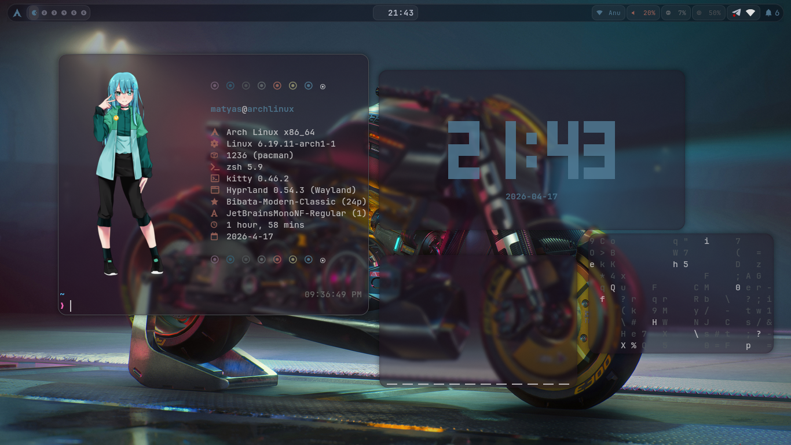

```
███╗   ███╗ █████╗ ███████╗██╗   ██╗
████╗ ████║██╔══██╗██╔════╝██║   ██║
██╔████╔██║███████║███████╗██║   ██║
██║╚██╔╝██║██╔══██║╚════██║██║   ██║
██║ ╚═╝ ██║██║  ██║███████║╚██████╔╝
╚═╝     ╚═╝╚═╝  ╚═╝╚══════╝ ╚═════╝
```

**by [Matyas Abraham (Maty156)](https://github.com/Maty156)**

---

## Screenshots

| Desktop |
|  |
| Wofi Launcher
| 

| Wallpaper Picker |
| 
| Fastfetch 
|  

---

## What's in the .config file

- 💎 **Glassmorphism** — refined Waybar with smoother blurs and glowing borders
- 📏 **Smart Gaps** — auto-hide gaps when only one window is open
- ✦ **Matuwall panel picker** — wallpaper picker from the left edge (`SUPER+W`)
- ✦ **Full pywal pipeline** — everything follows your wallpaper automatically
- ✦ **awww wallpaper daemon** — smooth transitions and persistence
- ✦ **Hyprlock** — lock screen always syncs with current wallpaper
- **SDDM** — login screen matches your wallpaper and pywal colors
- **Smooth animations** — fluid window animations with bezier curves
- **Wallpaper persistence** — last wallpaper restores on every reboot
- **Volume & brightness OSD** — wob overlay bar for media keys

---

## Dependencies

| Package | Purpose |
|---------|---------|
| `hyprland` | Window manager |
| `hyprlock` | Lock screen |
| `waybar` | Status bar |
| `wofi` | App launcher |
| `awww` | Wallpaper daemon |
| `matuwall` | GTK4 wallpaper picker panel |
| `swaync` | Notifications |
| `kitty` | Terminal |
| `python-pywal` | Dynamic color scheme generator |
| `wob` | Volume/brightness OSD |
| `rofi-wayland` | Application launcher |
| `grim` + `slurp` | Screenshots |
| `brightnessctl` | Brightness control |
| `playerctl` | Media control |
| `thunar` | File manager |
| `pavucontrol` | Audio control |
| `ttf-jetbrains-mono-nerd` | Font |
| `gtk4` + `libadwaita` + `gtk-layer-shell` | Matuwall dependencies |
| `jq` | JSON parsing |
| `imagemagick` | Image processing |

---

## Installation

```bash
git clone https://github.com/Maty156/.config
cd .config

```

## Keybindings

| Key | Action |
|-----|--------|
| `SUPER + Q` | Terminal (kitty) |
| `SUPER + SPACE` | App launcher (wofi) |
| `SUPER + W` | Wallpaper picker (matuwall panel) |
| `SUPER + E` | File manager (thunar) |
| `SUPER + C` | Close window |
| `SUPER + F` | Fullscreen |
| `SUPER + V` | Toggle floating |
| `SUPER + SHIFT + V` | Float + center + resize to 900×600 |
| `SUPER + L` | Lock screen |
| `SUPER + Delete` | Lock + sleep |
| `SUPER + M` | Exit Hyprland |
| `SUPER + S` | Scratchpad |
| `SUPER + 1-0` | Switch workspace |
| `SUPER + SHIFT + 1-0` | Move window to workspace |
| `SUPER + arrows` | Move focus |
| `SUPER + SHIFT + arrows` | Move window |
| `SUPER + ALT + arrows` | Resize window |
| `Print` | Screenshot (fullscreen) |
| `SUPER + Print` | Screenshot (area select) |
| `XF86AudioRaiseVolume` | Volume up + OSD |
| `XF86AudioLowerVolume` | Volume down + OSD |
| `XF86AudioMute` | Mute + OSD |
| `XF86MonBrightnessUp` | Brightness up + OSD |
| `XF86MonBrightnessDown` | Brightness down + OSD |

---

## Pywal Color Pipeline

When you pick a wallpaper with `SUPER+W`, the following update automatically:

```
Wallpaper selected (matuwall)
        │
        ▼
   awww sets wallpaper
        │
        ▼
   pywal generates colors
        │
        ├──▶ Waybar module colors
        ├──▶ Wofi launcher colors
        ├──▶ Swaync notification colors
        ├──▶ Hyprland border color
        ├──▶ Hyprlock wallpaper
        ├──▶ SDDM login screen wallpaper + colors
        ├──▶ wob OSD colors
        └──▶ Terminal colors (cmatrix, cava, etc.)
```

---

## Adding Wallpapers

Drop any `.jpg`, `.png`, `.webp` images into `~/wallpapers/` then press `SUPER+W` to open the picker. The panel slides in from the left — click a thumbnail to apply instantly.

---

## Structure

```
~/
├── wallpapers/
│   └── wallpaper.jpg
└── .configs/
    ├── hypr/
    │   ├── hyprland.conf
    │   ├── animations.conf
    │   ├── hyprland-colors.conf
    │   ├── hyprlock.conf
    │   └── scripts/
    │       ├── wallpaper-colors.sh   # pywal pipeline
    │       ├── wal-watcher.sh        # awww change detector
    │       ├── restore-wallpaper.sh  # startup restore
    │       ├── matuwall-toggle.sh    # SUPER+W toggle
    │       ├── hyprlock_wall.sh      # hyprlock sync
    │       ├── sddm-colors.sh        # SDDM color sync
    │       ├── volume-up/down/mute.sh
    │       └── brightness-up/down.sh
    ├── waybar/config + style.css
    ├── wofi/config + style.css
    ├── rofi/selector2.rasi + theme.rasi
    ├── swaync
    ├── wob/wob.ini
    ├── matuwall/config.json
    ├── fastfetch/
    │   │── images/
    │   │   │──test.jpg 
    │   │── config.jsonc
    └── wal/templates/
        ├── hyprland-colors.conf
        ├── colors-wofi.css
        ├── dunstrc
        └── wob.ini
```

---

## Credits

- Wallpaper picker by [Matuwall](https://github.com/naurissteins/Matuwall)
- Color pipeline powered by [pywal16](https://github.com/eylles/pywal16)
- Wallpaper daemon by [awww](https://codeberg.org/LGFae/awww)
- Installer structure inspired by [JaKooLit/Hyprland-Dots](https://github.com/JaKooLit/Hyprland-Dots)
- swaync by 

---

## License

MIT — feel free to use, modify and share.
